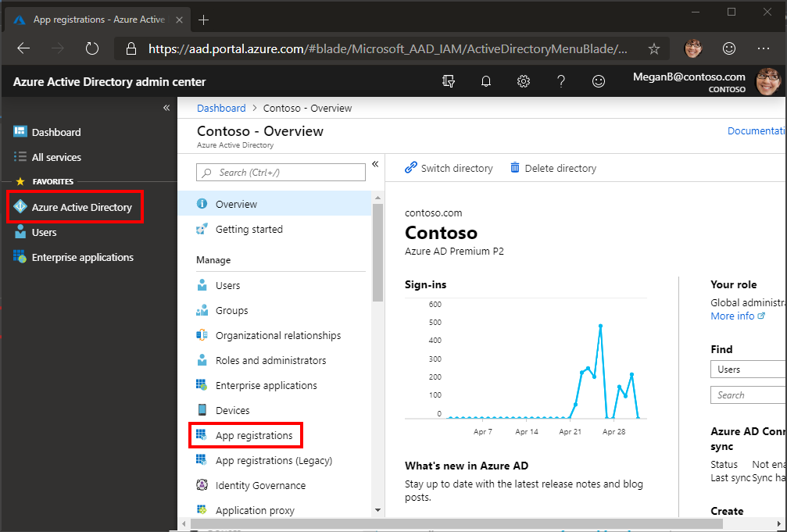
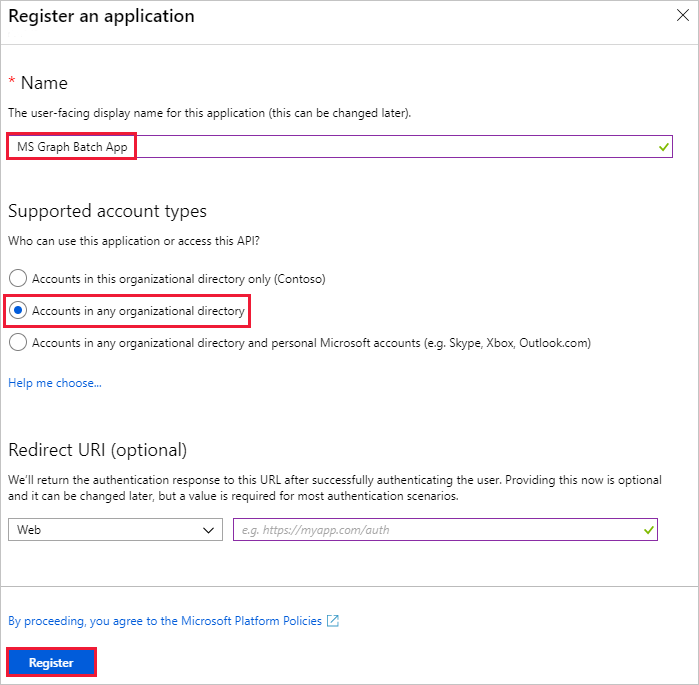
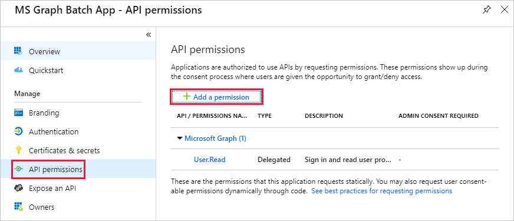
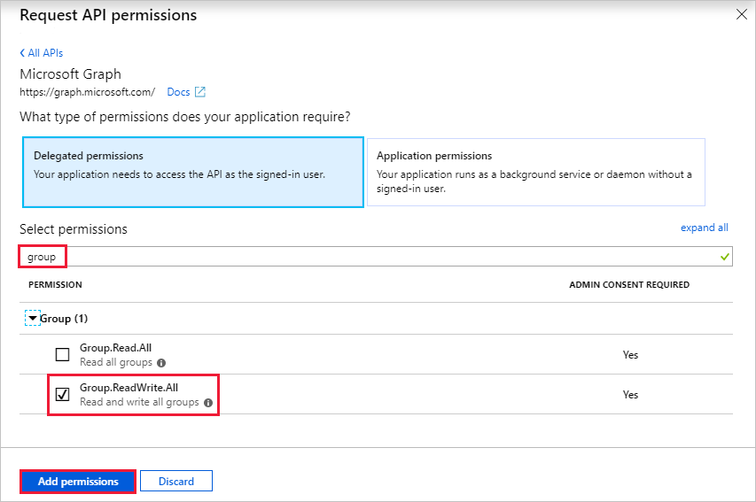
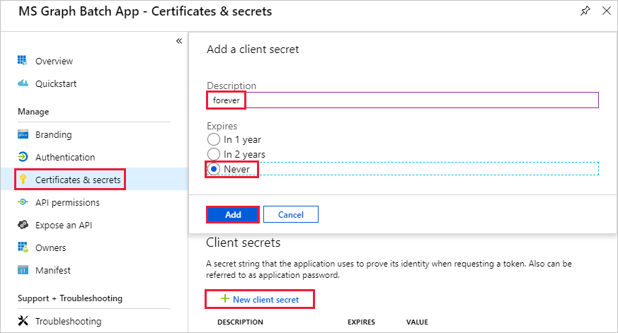
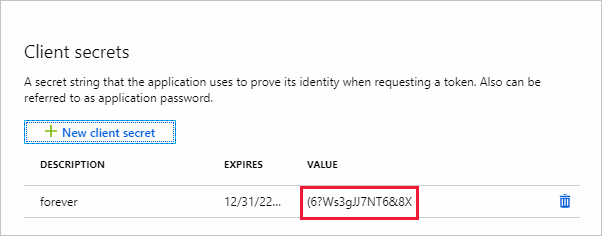

<!-- markdownlint-disable MD002 MD041 -->

この演習では、カスタムコネクタに対して委任されたアクセス許可を提供するために使用される新しい Azure Active Directory アプリケーションを作成します。

ブラウザーを開き、 [Azure Active Directory 管理センター](https://aad.portal.azure.com)に移動します。 左側のナビゲーションメニューで [ **Azure Active directory** ] リンクを選択し、 **azure active directory**ブレードの [**管理**] セクションで [**アプリの登録**] エントリを選択します。

**アプリ登録**ブレードの上部にある [**新しい登録**] メニュー項目を選択します。

`MS Graph Batch App`[**名前**] フィールドにを入力します。 [ **サポートされているアカウントの種類** ] セクションで、 **任意の組織ディレクトリの [アカウント**] を選択します。 [ **リダイレクト URI** ] セクションを空白のままにして、[ **登録**] を選択します。

**MS Graph バッチアプリ**ブレードで、**アプリケーション (クライアント) ID**をコピーします。 次の手順でこれを行う必要があります。

**MS Graph バッチアプリ**ブレードの [**管理**] セクションで、 **API アクセス許可**エントリを選択します。 [ **API アクセス許可**] の下で [**アクセス許可の追加**] を選択します。

[ **API アクセス許可の要求** ] ブレードで、 **Microsoft Graph**を選択し、[委任された **アクセス許可**] を選択します。 [検索 `group` ] を選択し、[ **すべてのグループの読み取りと書き込み** ] アクセス許可を選択します。 ブレードの下部にある [ **アクセス許可の追加** ] を選択します。

 

**MS Graph バッチアプリ**ブレードの [**管理**] セクションで、[**証明書と秘密**] エントリを選択し、[**新しいクライアントシークレット**] を選択します。 `forever`**説明**にを入力し、[**期限切れ**] の下で [**なし**] を選択します。 **[追加]** を選択します。

新しいシークレットの値をコピーします。 次の手順でこれを行う必要があります。

> [!IMPORTANT]
> この手順は、このブレードを閉じたときにシークレットにアクセスできないため、重要です。 このシークレットをテキストエディターに保存して、今後の演習で使用できるようにします。

Teams プロパティなど、Microsoft Graph からアクセスできる追加のサービスの管理を有効にするには、特定のサービスの管理を有効にするために、追加の適切なスコープを選択する必要があります。 たとえば、OneNote ノートブックまたはプランナープラン、バケット、タスクの作成を可能にするソリューションを拡張するには、関連する Api に必要なアクセス許可スコープを追加する必要があります。
