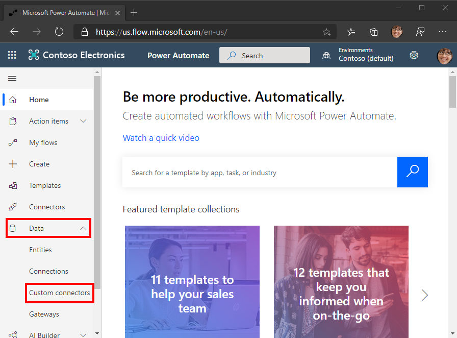
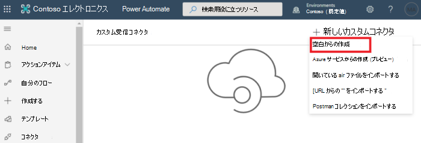

<!-- markdownlint-disable MD002 MD041 -->

この演習では、Microsoft Power オートメーションまたは Azure ロジックアプリで使用できる新しいカスタムコネクタを作成します。In this exercise, you will create a new custom connector which can be used in Microsoft Power Automate or in Azure Logic Apps. OpenAPI 定義ファイルには、Microsoft Graph エンドポイントの正しいパス `$batch` と、簡易インポートを有効にするための追加設定があらかじめ用意されています。The OpenAPI definition file is prebuilt with the correct path for the Microsoft Graph `$batch` endpoint and additional settings to enable simple import.

Microsoft Graph 用のカスタムコネクタを作成するには、次の2つのオプションがあります。There are two options to create a custom connector for Microsoft Graph:

- 空白からの作成Create from blank
- OpenAPI ファイルをインポートするImport an OpenAPI file

## オプション 1: 空のテンプレートからカスタムコネクタを作成するOption 1: Create custom connector from blank template

ブラウザーを開き、[ [Microsoft Power オートメーション](https://flow.microsoft.com)] に移動します。Open a browser and navigate to [Microsoft Power Automate](https://flow.microsoft.com). Office 365 テナント管理者アカウントでサインインします。Sign in with your Office 365 tenant administrator account. 左側のメニューで [ **データ** ] を選択し、ドロップダウンメニューの [ **カスタムコネクタ** ] 項目を選択します。Choose **Data** on the left-hand side menu, and select the **Custom Connectors** item in the drop-down menu.

[ **カスタムコネクタ** ] ページの右上にある [ **新しいカスタムコネクタ** ] リンクを選択し、ドロップダウンメニュー **から [空のアイテムを作成** する] を選択します。On the **Custom Connectors** page choose the **New custom connector** link in the top right, then select the **Create from blank** item in the drop-down menu.

[ `MS Graph Batch Connector` **コネクタ名** ] テキストボックスにを入力します。Enter `MS Graph Batch Connector` in the **Connector name** text box. Choose **Continue**.Choose **Continue**.

[コネクタ構成の **全般** ] ページで、フィールドに次のように入力します。On the connector configuration **General** page, fill in the fields as follows.

- **スキーム**: HTTPS**Scheme**: HTTPS
- **ホスト**: `graph.microsoft.com`**Host**: `graph.microsoft.com`
- **ベース URL**: `/`**Base URL**: `/`

[ **セキュリティ** ] ボタンを選択して続行します。Choose **Security** button to continue.

![コネクタ構成の [全般] タブのスクリーンショット](./images/general-tab.png)

[ **セキュリティ** ] ページで、フィールドに次のように入力します。On the **Security** page, fill in the fields as follows.

- **API によって実装されている認証を選択し**ます。 `OAuth 2.0`**Choose what authentication is implemented by your API**: `OAuth 2.0`
- **Id プロバイダー**: `Azure Active Directory`**Identity Provider**: `Azure Active Directory`
- **クライアント id**: 前の手順で作成したアプリケーション id**Client id**: the application ID you created in the previous exercise
- **クライアントシークレット**: 前の手順で作成したキー**Client secret**: the key you created in the previous exercise
- **ログイン url**: `https://login.windows.net`**Login url**: `https://login.windows.net`
- **テナント ID**: `common`**Tenant ID**: `common`
- **リソース URL**: `https://graph.microsoft.com` (末尾がありません)**Resource URL**: `https://graph.microsoft.com` (no trailing /)
- **範囲**: 空白のままにする**Scope**: Leave blank

[ **定義** ] ボタンを選択して続行します。Choose **Definition** button to continue.

![コネクタ構成の [セキュリティ] タブのスクリーンショット](./images/security-tab.png)

[ **定義** ] ページで、[ **新しいアクション** ] を選択し、フィールドに次のように入力します。On the **Definition** page, select **New Action** and fill in the fields as follows.

- **概要**: `Batch`**Summary**: `Batch`
- **説明**: `Execute Batch with Delegate Permission`**Description**: `Execute Batch with Delegate Permission`
- **操作 ID**: `Batch`**Operation ID**: `Batch`
- **表示**: `important`**Visibility**: `important`

![コネクタ構成の [定義] タブのスクリーンショット](./images/definition-tab.png)

[ **Sample からインポート**] を選択し、フィールドに次のように入力して**要求**を作成します。Create **Request** by selecting **Import from Sample** and fill in the fields as follows.

- **動詞**: `POST`**Verb**: `POST`
- **URL**: `https://graph.microsoft.com/v1.0/$batch`**URL**: `https://graph.microsoft.com/v1.0/$batch`
- **ヘッダー**: 空白のままにする**Headers**: Leave blank
- **本文**: `{}`**Body**: `{}`

**[インポート]** を選択します。Select **Import**.

![コネクタ構成の [インポート元サンプル] ダイアログのスクリーンショット](./images/import-sample.png)

右上にある [ **コネクタの作成** ] を選択します。Choose **Create Connector** on the top-right. コネクタが作成されたら、[**セキュリティ**] ページから、生成された**リダイレクト URL**をコピーします。After the connector has been created, copy the generated **Redirect URL** from **Security** page.

前の手順で作成した [Azure Portal](https://aad.portal.azure.com) の登録済みアプリケーションに戻ります。Go back to the registered application in the [Azure Portal](https://aad.portal.azure.com) you created in the previous exercise. 左側のメニューで [ **認証** ] を選択します。Select **Authentication** on the left-hand side menu. **[プラットフォームを追加]** を選択して、**[Web]** を選択します。Select **Add a platform**, then select **Web**. **リダイレクト uri**の前の手順でコピーしたリダイレクト URL を入力し、[**構成**] を選択します。Enter the redirect URL copied from the previous step in the **Redirect URIs**, then select **Configure**.

## オプション 2: OpenAPI ファイルをインポートしてカスタムコネクタを作成するOption 2: Create custom connector by importing OpenAPI file

テキストエディターを使用して、という名前の新しい空のファイルを作成 `MSGraph-Delegate-Batch.swagger.json` し、次のコードを追加します。Using a text editor, create a new empty file named `MSGraph-Delegate-Batch.swagger.json` and add the following code.

[!code-json]

ブラウザーを開き、[ [Microsoft Power オートメーション](https://flow.microsoft.com)] に移動します。Open a browser and navigate to [Microsoft Power Automate](https://flow.microsoft.com). Office 365 テナント管理者アカウントでサインインします。Sign in with your Office 365 tenant administrator account. 左側のメニューで [ **データ** ] を選択し、ドロップダウンメニューの [ **カスタムコネクタ** ] 項目を選択します。Choose **Data** on the left-hand side menu, and select the **Custom Connectors** item in the drop-down menu.

[ **カスタムコネクタ** ] ページの右上にある [ **新しいカスタムコネクタ** ] リンクを選択し、ドロップダウンメニューから [ **openapi ファイルをインポートする** ] 項目を選択します。On the **Custom Connectors** page choose the **New custom connector** link in the top right, then select the **Import an OpenAPI file** item in the drop-down menu.

[ `MS Graph Batch Connector` **コネクタ名** ] テキストボックスにを入力します。Enter `MS Graph Batch Connector` in the **Connector name** text box. [フォルダー] アイコンを選択して、OpenAPI ファイルをアップロードします。Choose the folder icon to upload the OpenAPI file. 作成したファイルを参照し `MSGraph-Delegate-Batch.swagger.json` ます。Browse to the `MSGraph-Delegate-Batch.swagger.json` file you created. [ **続行** ] を選択して、openapi ファイルをアップロードします。Choose **Continue** to upload the OpenAPI file.

[コネクタの構成] ページで、ナビゲーションメニューの [ **セキュリティ** ] リンクを選択します。On the connector configuration page, choose the **Security** link in the navigation menu. フィールドに次のように入力します。Fill in the fields as follows.

- **API によって実装されている認証を選択し**ます。 `OAuth 2.0`**Choose what authentication is implemented by your API**: `OAuth 2.0`
- **Id プロバイダー**: `Azure Active Directory`**Identity Provider**: `Azure Active Directory`
- **クライアント id**: 前の手順で作成したアプリケーション id**Client id**: the application ID you created in the previous exercise
- **クライアントシークレット**: 前の手順で作成したキー**Client secret**: the key you created in the previous exercise
- **ログイン url**: `https://login.windows.net`**Login url**: `https://login.windows.net`
- **テナント ID**: `common`**Tenant ID**: `common`
- **リソース URL**: `https://graph.microsoft.com` (末尾がありません)**Resource URL**: `https://graph.microsoft.com` (no trailing /)
- **範囲**: 空白のままにする**Scope**: Leave blank

右上にある [ **コネクタの作成** ] を選択します。Choose **Create Connector** on the top-right. コネクタが作成されたら、生成された **リダイレクト URL**をコピーします。After the connector has been created, copy the generated **Redirect URL**.

前の手順で作成した [Azure Portal](https://aad.portal.azure.com) の登録済みアプリケーションに戻ります。Go back to the registered application in the [Azure Portal](https://aad.portal.azure.com) you created in the previous exercise. 左側のメニューで [ **認証** ] を選択します。Select **Authentication** on the left-hand side menu. **[プラットフォームを追加]** を選択して、**[Web]** を選択します。Select **Add a platform**, then select **Web**. **リダイレクト uri**の前の手順でコピーしたリダイレクト URL を入力し、[**構成**] を選択します。Enter the redirect URL copied from the previous step in the **Redirect URIs**, then select **Configure**.

