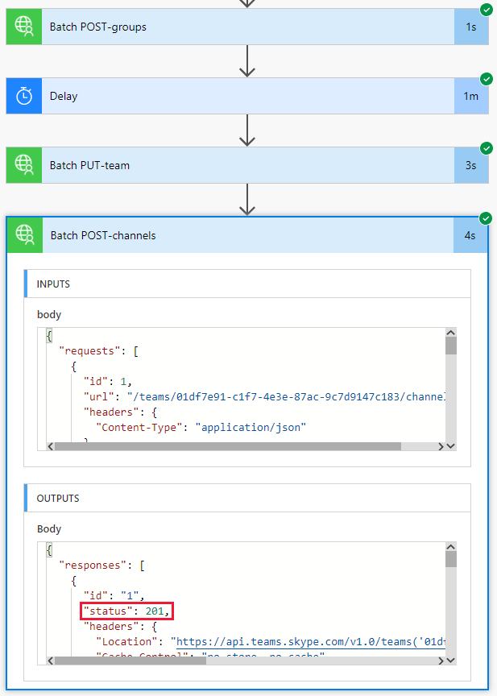

<!-- markdownlint-disable MD002 MD041 -->

<span data-ttu-id="6a56d-101">前の手順で作成したフローでは、API を使用して、 `$batch` Microsoft Graph に対する2つの個別の要求を行います。</span><span class="sxs-lookup"><span data-stu-id="6a56d-101">The Flow you created in the previous exercise uses the `$batch` API to make two individual requests to the Microsoft Graph.</span></span> <span data-ttu-id="6a56d-102">この方法を使用してエンドポイントを呼び出す `$batch` と、いくつかの利点と柔軟性が得られますが、 `$batch` 1 回の呼び出しで Microsoft Graph に複数の要求を実行するときに、エンドポイントの本当の威力を発揮し `$batch` ます。</span><span class="sxs-lookup"><span data-stu-id="6a56d-102">Calling the `$batch` endpoint this way provides some benefit and flexibility, but the true power of the `$batch` endpoint comes when executing multiple requests to Microsoft Graph in a single `$batch` call.</span></span> <span data-ttu-id="6a56d-103">この演習では、統合グループの作成例を拡張し、1つの要求でチームに複数の既定のチャネルを作成するようにチームを関連付け `$batch` ます。</span><span class="sxs-lookup"><span data-stu-id="6a56d-103">In this exercise, you will extend the example of creating a Unified Group and associating a Team to include creating multiple default Channels for the Team in a single `$batch` request.</span></span>

<span data-ttu-id="6a56d-104">ブラウザーで [Microsoft Power オートメーション](https://flow.microsoft.com) を開き、Office 365 テナント管理者アカウントでサインインします。</span><span class="sxs-lookup"><span data-stu-id="6a56d-104">Open [Microsoft Power Automate](https://flow.microsoft.com) in your browser and sign in with your Office 365 tenant administrator account.</span></span> <span data-ttu-id="6a56d-105">前の手順で作成したフローを選択し、[ **編集**] を選択します。</span><span class="sxs-lookup"><span data-stu-id="6a56d-105">Select the Flow you created in the previous step and choose **Edit**.</span></span>

<span data-ttu-id="6a56d-106">[ **新しい手順** ] を選択し `Batch` 、検索ボックスに入力します。</span><span class="sxs-lookup"><span data-stu-id="6a56d-106">Choose **New step** and type `Batch` in the search box.</span></span> <span data-ttu-id="6a56d-107">[ **MS Graph バッチコネクタ** ] アクションを追加します。</span><span class="sxs-lookup"><span data-stu-id="6a56d-107">Add the **MS Graph Batch Connector** action.</span></span> <span data-ttu-id="6a56d-108">省略記号を選択して、このアクションの名前をに変更 `Batch POST-channels` します。</span><span class="sxs-lookup"><span data-stu-id="6a56d-108">Choose the ellipsis and rename this action to `Batch POST-channels`.</span></span>

<span data-ttu-id="6a56d-109">アクションの **本文** テキストボックスに次のコードを追加します。</span><span class="sxs-lookup"><span data-stu-id="6a56d-109">Add the following code into the **body** text box of the action.</span></span>

```json
{
  "requests": [
    {
      "id": 1,
      "url": "/teams/REPLACE/channels",
      "headers": {
        "Content-Type": "application/json"
      },
      "method": "POST",
      "body": {
        "displayName": "Marketing Collateral",
        "description": "Marketing collateral and documentation."
      }
    },
    {
      "id": 2,
      "dependsOn": [
        "1"
      ],
      "url": "/teams/REPLACE/channels",
      "headers": {
        "Content-Type": "application/json"
      },
      "method": "POST",
      "body": {
        "displayName": "Vendor Contracts",
        "description": "Vendor documents, contracts, agreements and schedules."
      }
    },
    {
      "id": 3,
      "dependsOn": [
        "2"
      ],
      "url": "/teams/REPLACE/channels",
      "headers": {
        "Content-Type": "application/json"
      },
      "method": "POST",
      "body": {
        "displayName": "General Client Agreements",
        "description": "General Client documents and agreements."
      }
    }
  ]
}
```

<span data-ttu-id="6a56d-110">上記の3つの要求は、シーケンスの順序を指定するために [dependsOn](https://docs.microsoft.com/graph/json-batching#sequencing-requests-with-the-dependson-property) プロパティを使用していて、それぞれが新しいチームで新しいチャネルを作成するために POST 要求を実行することに注意してください。</span><span class="sxs-lookup"><span data-stu-id="6a56d-110">Notice the three requests above are using the [dependsOn](https://docs.microsoft.com/graph/json-batching#sequencing-requests-with-the-dependson-property) property to specify a sequence order, and each will execute a POST request to create a new channel in the new Team.</span></span>

<span data-ttu-id="6a56d-111">プレースホルダーの各インスタンスを選択し、 `REPLACE` [動的コンテンツ] ウィンドウで [ **式** ] を選択します。</span><span class="sxs-lookup"><span data-stu-id="6a56d-111">Select each instance of the `REPLACE` placeholder, then select **Expression** in the dynamic content pane.</span></span> <span data-ttu-id="6a56d-112">次の数式を **式**に追加します。</span><span class="sxs-lookup"><span data-stu-id="6a56d-112">Add the following formula into the **Expression**.</span></span>

```js
body('Batch_PUT-team').responses[0].body.id
```

![[動的コンテンツ] ウィンドウ内の式のスクリーンショット](./images/dynamic-expression.png)

<span data-ttu-id="6a56d-114">[ **保存**] を選択し、[ **テスト** ] を選択してフローを実行します。</span><span class="sxs-lookup"><span data-stu-id="6a56d-114">Choose **Save**, then choose **Test** to execute the Flow.</span></span> <span data-ttu-id="6a56d-115">[トリガーアクションを **実行** する] ラジオボタンを選択し、[ **Save & Test**] を選択します。</span><span class="sxs-lookup"><span data-stu-id="6a56d-115">Select the **I'll perform the trigger** action radio button, then choose **Save & Test**.</span></span> <span data-ttu-id="6a56d-116">[ **名前** ] フィールドにスペースを入れずに一意のグループ名を入力し、[ **実行フロー** ] を選択してフローを実行します。</span><span class="sxs-lookup"><span data-stu-id="6a56d-116">Enter a unique group name in the **Name** field without spaces, and choose **Run flow** to execute the Flow.</span></span>

<span data-ttu-id="6a56d-117">フローが開始されたら、[ **完了** ] ボタンをクリックしてアクティビティログを表示します。</span><span class="sxs-lookup"><span data-stu-id="6a56d-117">Once the Flow starts, choose the **Done** button to see the activity log.</span></span> <span data-ttu-id="6a56d-118">フローが完了すると、アクションの最終出力には、 `Batch POST-channels` 作成された各チャネルに対して 201 HTTP 状態応答があります。</span><span class="sxs-lookup"><span data-stu-id="6a56d-118">When the Flow completes, the final output for the `Batch POST-channels` action has a 201 HTTP Status response for each Channel created.</span></span>



<span data-ttu-id="6a56d-120">[Microsoft Teams](https://teams.microsoft.com)を参照して、Office 365 テナント管理者アカウントでサインインします。</span><span class="sxs-lookup"><span data-stu-id="6a56d-120">Browse to [Microsoft Teams](https://teams.microsoft.com) and sign in with your Office 365 tenant administrator account.</span></span> <span data-ttu-id="6a56d-121">作成したチームが表示されることと、要求によって作成された3つのチャネルが含まれていることを確認し `$batch` ます。</span><span class="sxs-lookup"><span data-stu-id="6a56d-121">Verify that the team you just created appears and includes the three channels created by the `$batch` request.</span></span>


<span data-ttu-id="6a56d-123">`Batch POST-channels`このチュートリアルでは、この操作は個別のアクションとして実装されていましたが、チャネルを作成する呼び出しは、アクションに追加の呼び出しとして追加されている可能性があり `Batch PUT-team` ます。</span><span class="sxs-lookup"><span data-stu-id="6a56d-123">While the above `Batch POST-channels` action was implemented in this tutorial as a separate action, the calls to create the channels could have been added as additional calls in the `Batch PUT-team` action.</span></span> <span data-ttu-id="6a56d-124">これにより、1回のバッチ呼び出しでチームとすべてのチャネルが作成されます。</span><span class="sxs-lookup"><span data-stu-id="6a56d-124">This would have created the Team and all Channels in a single batch call.</span></span> <span data-ttu-id="6a56d-125">自分で試してみてください。</span><span class="sxs-lookup"><span data-stu-id="6a56d-125">Give that a try on your own.</span></span>

<span data-ttu-id="6a56d-126">最後に、 [JSON のバッチ](https://docs.microsoft.com/graph/json-batching) 呼び出しは、要求ごとに HTTP 状態コードを返すことに注意してください。</span><span class="sxs-lookup"><span data-stu-id="6a56d-126">Finally, remember that [JSON Batching](https://docs.microsoft.com/graph/json-batching) calls will return an HTTP status code for each request.</span></span> <span data-ttu-id="6a56d-127">運用プロセスでは、結果の事後処理をアクションと組み合わせ [`Apply to each`](https://docs.microsoft.com/power-automate/apply-to-each) て、個々の応答に201状態コードがあることを検証したり、受信した他の状態コードを補正したりできます。</span><span class="sxs-lookup"><span data-stu-id="6a56d-127">In a production process, you may want to combine post processing of the results with an [`Apply to each`](https://docs.microsoft.com/power-automate/apply-to-each) action and validate each individual response has a 201 status code or compensate for any other status codes received.</span></span>
