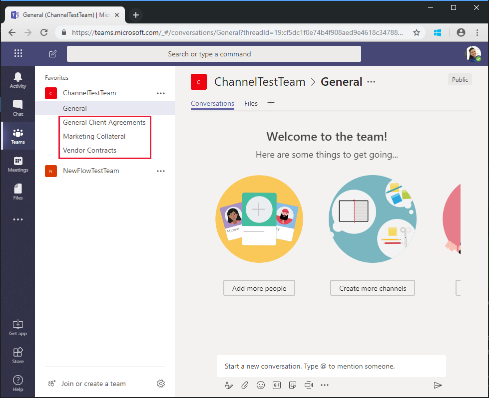

<!-- markdownlint-disable MD002 MD041 -->

<span data-ttu-id="437bc-101">前の手順で作成したフローでは`$batch` 、API を使用して、Microsoft Graph に対する2つの個別の要求を行います。</span><span class="sxs-lookup"><span data-stu-id="437bc-101">The Flow you created in the previous exercise uses the `$batch` API to make two individual requests to the Microsoft Graph.</span></span> <span data-ttu-id="437bc-102">この方法`$batch`を使用してエンドポイントを呼び出すと、いくつかの利点`$batch`と柔軟性が得られますが、1回`$batch`の呼び出しで Microsoft Graph に複数の要求を実行するときに、エンドポイントの本当の威力を発揮します。</span><span class="sxs-lookup"><span data-stu-id="437bc-102">Calling the `$batch` endpoint this way provides some benefit and flexibility, but the true power of the `$batch` endpoint comes when executing multiple requests to Microsoft Graph in a single `$batch` call.</span></span> <span data-ttu-id="437bc-103">この演習では、統合グループの作成例を拡張し、1つ`$batch`の要求でチームに複数の既定のチャネルを作成するようにチームを関連付けます。</span><span class="sxs-lookup"><span data-stu-id="437bc-103">In this exercise, you will extend the example of creating a Unified Group and associating a Team to include creating multiple default Channels for the Team in a single `$batch` request.</span></span>

<span data-ttu-id="437bc-104">ブラウザーで[Microsoft Flow](https://flow.microsoft.com)を開き、Office 365 テナント管理者アカウントでサインインします。</span><span class="sxs-lookup"><span data-stu-id="437bc-104">Open [Microsoft Flow](https://flow.microsoft.com) in your browser and sign in with your Office 365 tenant administrator account.</span></span> <span data-ttu-id="437bc-105">前の手順で作成したフローを選択し、[**編集**] を選択します。</span><span class="sxs-lookup"><span data-stu-id="437bc-105">Select the Flow you created in the previous step and choose **Edit**.</span></span>

<span data-ttu-id="437bc-106">[**新しい手順**] を`Batch`選択し、検索ボックスに入力します。</span><span class="sxs-lookup"><span data-stu-id="437bc-106">Choose **New step** and type `Batch` in the search box.</span></span> <span data-ttu-id="437bc-107">[ **MS Graph バッチコネクタ**] アクションを追加します。</span><span class="sxs-lookup"><span data-stu-id="437bc-107">Add the **MS Graph Batch Connector** action.</span></span> <span data-ttu-id="437bc-108">省略記号を選択して、この`Batch POST-channels`アクションの名前をに変更します。</span><span class="sxs-lookup"><span data-stu-id="437bc-108">Choose the ellipsis and rename this action to `Batch POST-channels`.</span></span>

<span data-ttu-id="437bc-109">アクションの**本文**テキストボックスに次のコードを追加します。</span><span class="sxs-lookup"><span data-stu-id="437bc-109">Add the following code into the **body** text box of the action.</span></span>

```json
{
  "requests": [
    {
      "id": 1,
      "url": "/teams/REPLACE/channels",
      "headers": {
        "Content-Type": "application/json"
      },
      "method": "POST",
      "body": {
        "displayName": "Marketing Collateral",
        "description": "Marketing collateral and documentation."
      }
    },
    {
      "id": 2,
      "dependsOn": [
        "1"
      ],
      "url": "/teams/REPLACE/channels",
      "headers": {
        "Content-Type": "application/json"
      },
      "method": "POST",
      "body": {
        "displayName": "Vendor Contracts",
        "description": "Vendor documents, contracts, agreements and schedules."
      }
    },
    {
      "id": 3,
      "dependsOn": [
        "2"
      ],
      "url": "/teams/REPLACE/channels",
      "headers": {
        "Content-Type": "application/json"
      },
      "method": "POST",
      "body": {
        "displayName": "General Client Agreements",
        "description": "General Client documents and agreements."
      }
    }
  ]
}
```

<span data-ttu-id="437bc-110">上記の3つの要求は、シーケンスの順序を指定するために[dependsOn](https://docs.microsoft.com/graph/json-batching#sequencing-requests-with-the-dependson-property)プロパティを使用していて、それぞれが新しいチームで新しいチャネルを作成するために POST 要求を実行することに注意してください。</span><span class="sxs-lookup"><span data-stu-id="437bc-110">Notice the three requests above are using the [dependsOn](https://docs.microsoft.com/graph/json-batching#sequencing-requests-with-the-dependson-property) property to specify a sequence order, and each will execute a POST request to create a new channel in the new Team.</span></span>

<span data-ttu-id="437bc-111">`REPLACE`プレースホルダーの各インスタンスを選択し、[動的コンテンツ] ウィンドウで [**式**] を選択します。</span><span class="sxs-lookup"><span data-stu-id="437bc-111">Select each instance of the `REPLACE` placeholder, then select **Expression** in the dynamic content pane.</span></span> <span data-ttu-id="437bc-112">次の数式を**式**に追加します。</span><span class="sxs-lookup"><span data-stu-id="437bc-112">Add the following formula into the **Expression**.</span></span>

```js
body('Batch_PUT-team').responses[0].body.id
```

![[動的コンテンツ] ウィンドウ内の式のスクリーンショット](./images/flow-channel1.png)

<span data-ttu-id="437bc-114">[**保存**] を選択し、[**テスト**] を選択してフローを実行します。</span><span class="sxs-lookup"><span data-stu-id="437bc-114">Choose **Save**, then choose **Test** to execute the Flow.</span></span> <span data-ttu-id="437bc-115">[トリガーアクションを**実行**する] ラジオボタンを選択し、[ **Save & Test**] を選択します。</span><span class="sxs-lookup"><span data-stu-id="437bc-115">Select the **I'll perform the trigger** action radio button, then choose **Save & Test**.</span></span> <span data-ttu-id="437bc-116">[**名前**] フィールドにスペースを入れずに一意のグループ名を入力し、[**実行フロー** ] を選択してフローを実行します。</span><span class="sxs-lookup"><span data-stu-id="437bc-116">Enter a unique group name in the **Name** field without spaces, and choose **Run flow** to execute the Flow.</span></span>

<span data-ttu-id="437bc-117">フローが開始されたら、[**完了**] ボタンをクリックしてアクティビティログを表示します。</span><span class="sxs-lookup"><span data-stu-id="437bc-117">Once the Flow starts, choose the **Done** button to see the activity log.</span></span> <span data-ttu-id="437bc-118">フローが完了すると、 `Batch POST-channels`アクションの最終出力には、作成された各チャネルに対して 201 HTTP 状態応答があります。</span><span class="sxs-lookup"><span data-stu-id="437bc-118">When the Flow completes, the final output for the `Batch POST-channels` action has a 201 HTTP Status response for each Channel created.</span></span>


<span data-ttu-id="437bc-120">[Microsoft Teams](https://teams.microsoft.com)を参照して、Office 365 テナント管理者アカウントでサインインします。</span><span class="sxs-lookup"><span data-stu-id="437bc-120">Browse to [Microsoft Teams](https://teams.microsoft.com) and sign in with your Office 365 tenant administrator account.</span></span> <span data-ttu-id="437bc-121">作成したチームが表示されることと、 `$batch`要求によって作成された3つのチャネルが含まれていることを確認します。</span><span class="sxs-lookup"><span data-stu-id="437bc-121">Verify that the team you just created appears and includes the three channels created by the `$batch` request.</span></span>



<span data-ttu-id="437bc-123">このチュートリアルで`Batch POST-channels`は、この操作は個別のアクションとして実装されていましたが、チャネルを作成する呼び出しは`Batch PUT-team` 、アクションに追加の呼び出しとして追加されている可能性があります。</span><span class="sxs-lookup"><span data-stu-id="437bc-123">While the above `Batch POST-channels` action was implemented in this tutorial as a separate action, the calls to create the channels could have been added as additional calls in the `Batch PUT-team` action.</span></span> <span data-ttu-id="437bc-124">これにより、1回のバッチ呼び出しでチームとすべてのチャネルが作成されます。</span><span class="sxs-lookup"><span data-stu-id="437bc-124">This would have created the Team and all Channels in a single batch call.</span></span> <span data-ttu-id="437bc-125">自分で試してみてください。</span><span class="sxs-lookup"><span data-stu-id="437bc-125">Give that a try on your own.</span></span>

<span data-ttu-id="437bc-126">最後に、 [JSON のバッチ](https://docs.microsoft.com/graph/json-batching)呼び出しは、要求ごとに HTTP 状態コードを返すことに注意してください。</span><span class="sxs-lookup"><span data-stu-id="437bc-126">Finally, remember that [JSON Batching](https://docs.microsoft.com/graph/json-batching) calls will return an HTTP status code for each request.</span></span> <span data-ttu-id="437bc-127">運用プロセスでは、結果の事後処理を[`Apply to each`](https://docs.microsoft.com/flow/apply-to-each)アクションと組み合わせて、個々の応答に201状態コードがあることを検証したり、受信した他の状態コードを補正したりできます。</span><span class="sxs-lookup"><span data-stu-id="437bc-127">In a production process, you may want to combine post processing of the results with an [`Apply to each`](https://docs.microsoft.com/flow/apply-to-each) action and validate each individual response has a 201 status code or compensate for any other status codes received.</span></span>
